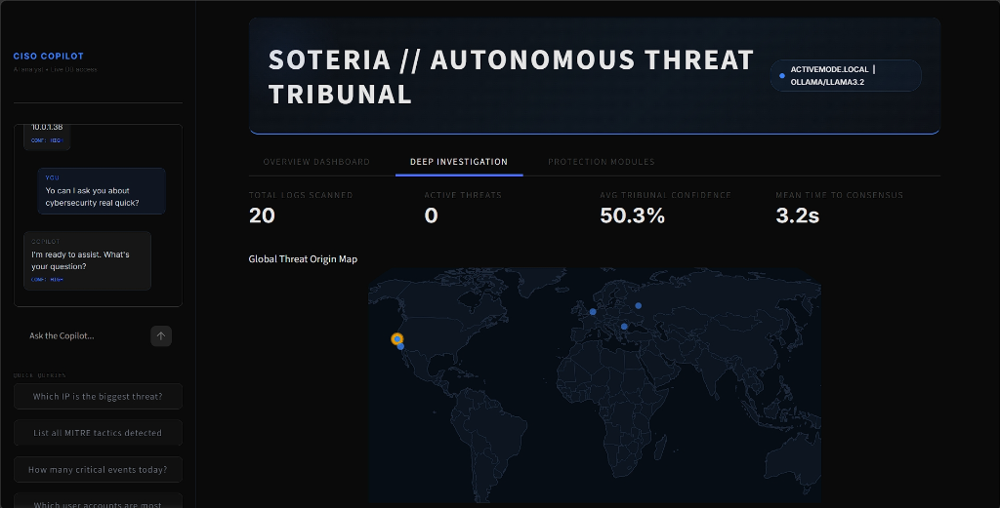
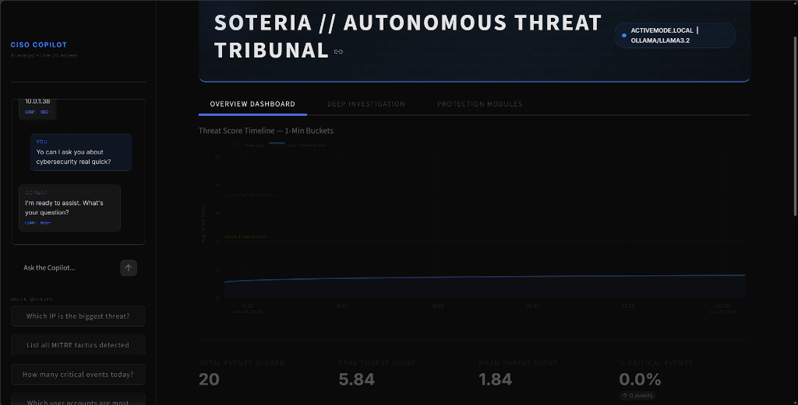
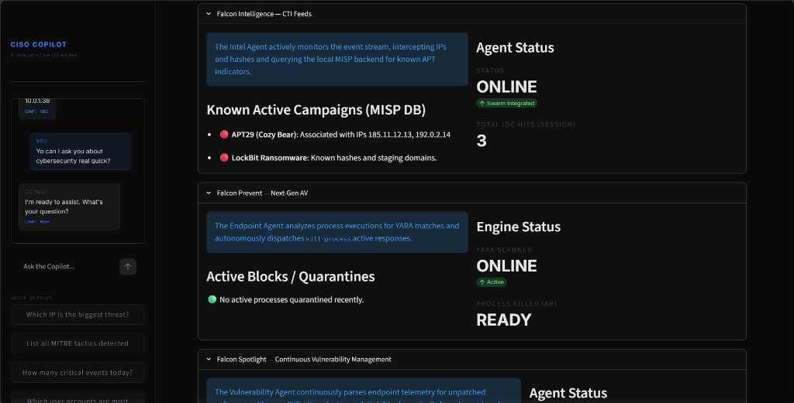
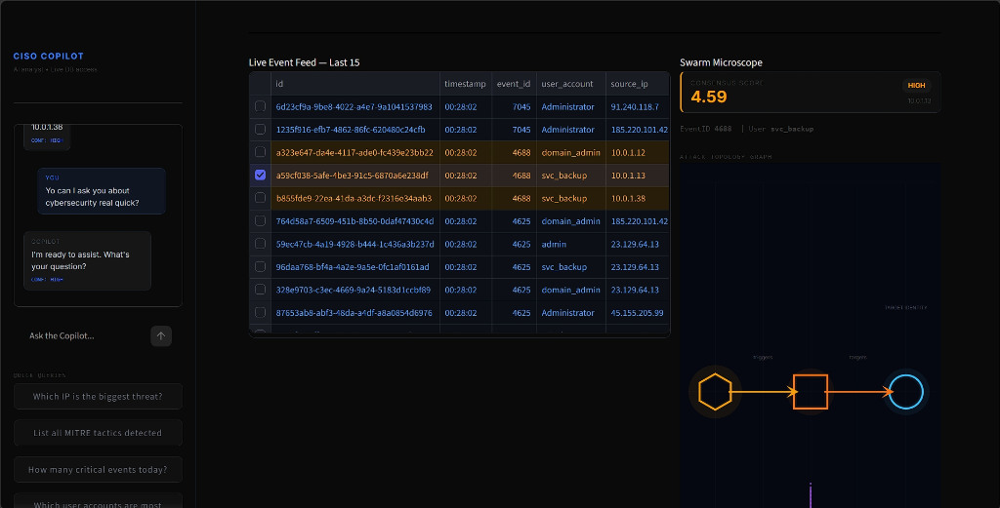
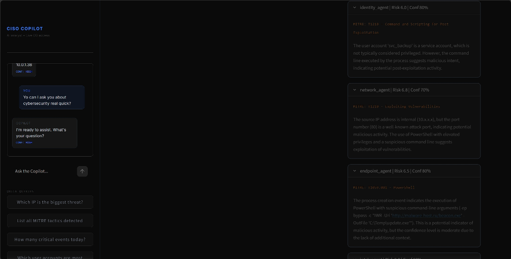

# SoterIA: Autonomous Threat Tribunal


<br>

<div align="center">
  
  <br><br>

  
  <br><br>

  
  <br><br>

  
  <br><br>

  
</div>

<br>

SoterIA is an elite, autonomous Security Operations Center (SOC) platform designed for fully air-gapped environments. It utilizes a multi-agent LLM swarm to continuously ingest, triage, and score security events in real time. 

Featuring an advanced **Threat Tribunal** and an integrated **CISO Copilot**, SoterIA allows you to query your live database with natural language to investigate active threats, lateral movement, and critical infrastructure attacks.

## Working Principle and Flow

SoterIA operates on a continuous pipeline of telemetry ingestion, autonomous AI analysis, and proactive response:

1. **Telemetry Ingestion:** Endpoint agents (like Wazuh) and system logs stream raw security events into a high-speed local database.
2. **Autonomous Swarm Analysis (The Tribunal):** Every new event triggers the Threat Tribunal. A swarm of specialized AI agents asynchronously evaluate the event:
    - **Identity Agent:** Analyzes user context and potential privilege escalation.
    - **Network Agent:** Evaluates IP reputation, connection ports, and lateral movement.
    - **Endpoint Agent:** Scans process trees, command lines, and local anomalies.
    - **Intel Agent:** Cross-references IoCs (IPs, hashes) against local CTI feeds (e.g., MISP).
    - **Vulnerability Agent:** Maps affected endpoint software to known zero-days and CVEs.
3. **Consensus Scoring:** The Tribunal aggregates the confidence and risk scores from all 5 agents to generate a single, definitive consensus threat score.
4. **Active Response:** If the consensus score crosses the critical threshold, SoterIA autonomously dispatches targeted active responses (e.g., `kill-process` or network isolation) to neutralize the threat instantly.
5. **CISO Copilot:** Human analysts can interact directly with the database via a natural-language AI Copilot to investigate specific IPs, hunt for anomalies, and query historical logs.

## Core Features
*   **Agentic Swarm Triage:** Autonomous AI agents analyze raw logs and vote on severity using a consensus-based Threat Tribunal.
*   **Fully Air-Gapped:** 100% local LLM execution via Ollama (`llama3.2`). No API keys, no data exfiltration.
*   **CISO Copilot:** An interactive, contextual AI assistant that answers questions directly based on the live security event database.
*   **Enterprise UI:** Sleek, high-performance Streamlit dashboard featuring live telemetry, event queues, and lateral movement topology graphs.
*   **Protection Modules:** Built-in cloned capabilities of tier-1 tools, including Continuous Threat Intelligence (CTI), Next-Gen AV, and Vulnerability Management.

## Installation

Ensure you have Python 3.10+ and [Ollama](https://ollama.ai) installed on your system.

```bash
# 1. Clone the repository
git clone https://github.com/ZenithOrionis/SoterIA.git
cd SoterIA

# 2. Install dependencies
pip install -r requirements.txt

# 3. Pull the local LLM via Ollama
ollama pull llama3.2
```

## Running the SOC

SoterIA consists of two main components: the background autonomous engine and the Streamlit frontend.

### 1. Start the Autonomous Engine
Run the SOC engine to start listening for events and processing the AI Tribunal.
```bash
python run_soc.py
```

### 2. Launch the Command Dashboard
In a separate terminal, launch the Streamlit interface.
```bash
python -m streamlit run src/ui/app.py
```

### 3. (Optional) Inject Test Threats
Want to see the agents in action? Use the mock generator to simulate attacks:
```bash
python -c "import sys; sys.path.append('.'); from src.services.mock_generator import run; run(max_count=10)"
```

## Architecture
- **Data Layer:** SQLite (`data/soc_logs.db`)
- **Backend Swarm:** Python `asyncio`, LiteLLM Gateway
- **Frontend Dashboard:** Streamlit, Plotly, Custom CSS

## License
Refer to the `LICENSE` file for details.
